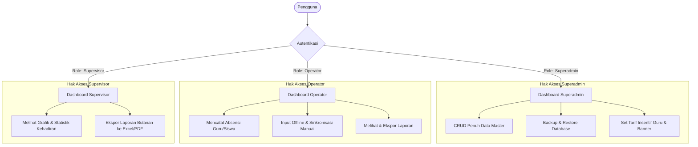
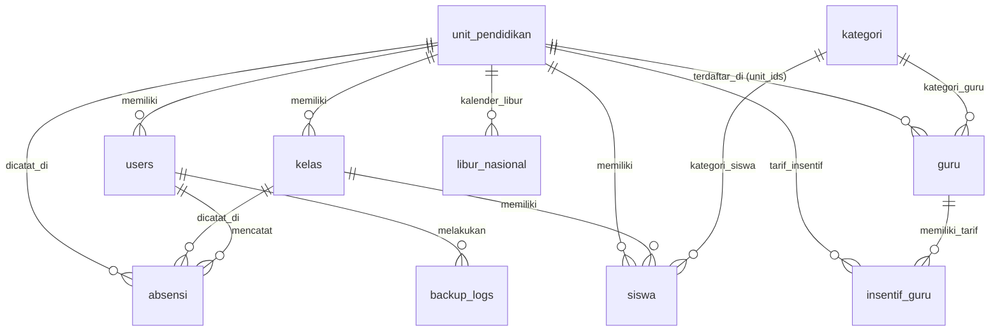
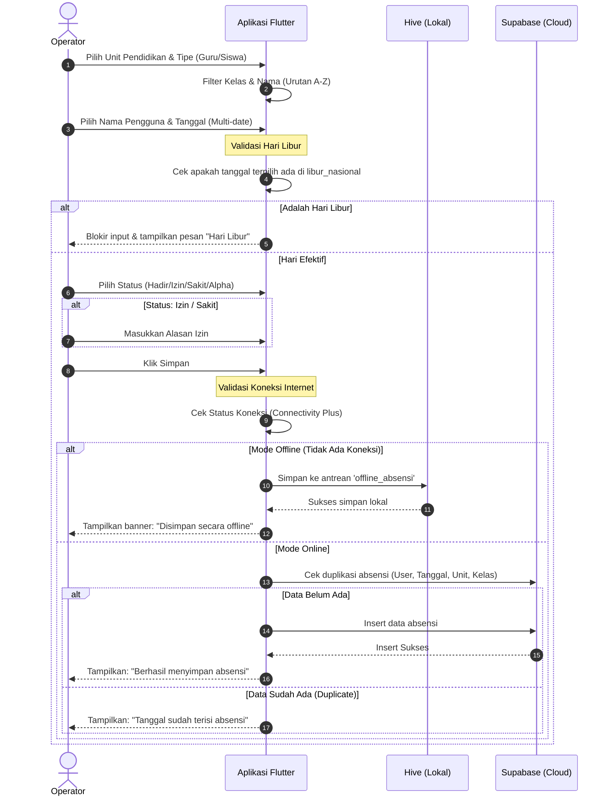

# Analisis Alur Bisnis & Arsitektur GMQ Absensi V2 (GMQ Super App)

Dokumen ini menyajikan analisis komprehensif mengenai **GMQ Absensi V2** (juga dikenal sebagai **GMQ Super App**), sebuah sistem manajemen kehadiran sekolah terintegrasi yang dikembangkan untuk **Yayasan Gerakan Memakmurkan Masjid & Quran (YGMQ)**.

---

## 1. Pendahuluan & Tujuan Sistem

Aplikasi **GMQ Absensi V2** dirancang untuk mengotomatisasi, memantau, dan mencatat kehadiran guru serta santri (siswa) secara efisien di bawah naungan YGMQ. Sistem ini mengatasi tantangan pencatatan kehadiran manual dan memfasilitasi pelaporan real-time, manajemen insentif guru, serta mendukung pengisian absensi di area dengan koneksi internet yang tidak stabil (fitur offline-first).

### Arsitektur Teknologi Utama:
*   **Frontend**: Flutter SDK (mendukung multiplatform: Android & Web). Deployment web menggunakan **Firebase Hosting**.
*   **Backend & Database**: **Supabase** (PostgreSQL) untuk manajemen database, otentikasi (GoTrue), dan REST API.
*   **Penyimpanan Lokal & Sinkronisasi**: **Hive** (`hive_flutter`) untuk caching lokal dan penyimpanan antrean absensi offline.
*   **Deteksi Koneksi**: `connectivity_plus` dipadukan dengan lookup DNS eksternal untuk mendeteksi status online/offline secara presisi.

---

## 2. Struktur Peran & Hak Akses (Role-Based Access Control)

Sistem ini menerapkan pembatasan hak akses yang ketat berdasarkan peran pengguna (Role) untuk menjaga keamanan data:

### Detail Peran:
1.  **Superadmin**:
    *   Manajemen master-data secara menyeluruh (Unit Pendidikan, Kelas, Guru, Siswa, dan Pengguna/Akun).
    *   Konfigurasi tarif insentif harian guru per unit pendidikan.
    *   Pengelolaan kalender libur nasional dan libur spesifik unit.
    *   Operasi backup dan restore database melalui logging database.
2.  **Operator**:
    *   Pencatatan kehadiran harian guru dan siswa.
    *   Mendukung pengisian absensi dalam kondisi offline (tersimpan di Hive lokal) dan melakukan sinkronisasi otomatis/manual saat terhubung ke internet.
    *   Mengakses dan mengunduh laporan kehadiran serta laporan insentif guru.
3.  **Supervisor**:
    *   Memantau statistik dan grafik kehadiran secara real-time pada dasbor.
    *   Melakukan filter dan mengekspor laporan kehadiran / laporan insentif guru dalam format Excel.

---

## 3. Desain Skema Database (Supabase / PostgreSQL)

Sistem didukung oleh struktur database PostgreSQL di Supabase dengan relasi antar-tabel sebagai berikut:

### Tabel Operasional Utama:
*   **`users`**: Menyimpan akun operator/supervisor/admin. Relasi ke `unit_pendidikan` (`unit_id`) membatasi ruang lingkup unit yang dikelola oleh operator tersebut.
*   **`absensi`**: Menyimpan log transaksi kehadiran.
    *   `user_type`: Menentukan apakah subjek absensi adalah `'siswa'` atau `'guru'`.
    *   `user_id`: Menyimpan ID Guru atau ID Siswa secara dinamis.
    *   `status`: Status kehadiran berupa **Hadir (hadir)**, **Izin (izin)**, **Sakit (sakit)**, **Alpha (alpha)**, atau **Libur (libur)**.
    *   *Constraint*: Terdapat indeks unik gabungan (`user_type, user_id, date, unit_id, kelas_id`) untuk mencegah pencatatan ganda pada hari dan kelas/unit yang sama.
*   **`guru`**: Mendukung multi-unit dan multi-kelas menggunakan kolom bertipe `ARRAY` (`unit_ids` dan `kelas_ids`). Ini memungkinkan guru mengajar di lebih dari satu unit/kelas pada hari yang sama.
*   **`insentif_guru`**: Menentukan nominal uang insentif per hari untuk seorang guru di unit tertentu.
*   **`libur_nasional`**: Menyimpan daftar tanggal libur yang bersifat global (nasional) maupun libur lokal (hanya berlaku untuk `unit_id` tertentu).

---

## 4. Alur Bisnis Utama (Core Business Workflows)

### A. Alur Pencatatan Kehadiran (Input Absensi)

Proses ini dilakukan oleh **Operator** melalui modul `InputScreen`. Sistem melakukan validasi berlapis sebelum menyimpan data:

### B. Mekanisme Sinkronisasi Otomatis (Offline-to-Online Sync)

Fitur ini menjamin data tidak hilang ketika operator melakukan pencatatan di lapangan tanpa internet:
1.  **Penyimpanan Antrean**: Jika perangkat offline, data absensi disimpan ke dalam Hive box `gmq_cache` di bawah kunci `'offline_absensi'`.
2.  **Deteksi Koneksi Kembali**: Aplikasi memantau status jaringan menggunakan event listener `onConnectivityChanged`.
3.  **Proses Sinkronisasi**:
    *   Saat internet terhubung kembali, aplikasi secara otomatis memanggil fungsi `syncOfflineData()`.
    *   Sistem membaca seluruh daftar antrean offline, menyaring kolom agar sesuai dengan skema Supabase (menghapus metadata visual seperti nama guru/unit agar tidak di-reject oleh database), lalu melakukan *insert* ke tabel `absensi`.
    *   Data yang sukses di-sinkronisasi akan dihapus dari antrean lokal. Data yang gagal (misalnya karena bentrok constraint unik) akan dievaluasi dan antrean lokal diperbarui.
    *   Terdapat tombol **Sinkronisasi Manual** di bilah navigasi atas (AppBar) dasbor operator untuk memicu sinkronisasi kapan saja secara mandiri.

---

## 5. Fitur Penunjang & Operasional Lainnya

### A. Perhitungan Insentif Guru (Payroll Dasar)
1.  Admin mengonfigurasi nominal insentif harian per guru di setiap unit pada tabel `insentif_guru` (misal: Guru A mendapatkan Rp50.000/hari di Unit SD, Rp60.000/hari di Unit SMP).
2.  Sistem merekap jumlah kehadiran (`status = 'hadir'`) guru tersebut pada periode bulan berjalan di unit terkait.
3.  Total insentif bulanan diperoleh melalui rumus:
    $$\text{Total Insentif} = \text{Jumlah Kehadiran Hadir} \times \text{Nominal Insentif Harian}$$
4.  Laporan ini dapat diunduh langsung dalam format Excel oleh Supervisor atau Operator.

### B. Validasi Kalender Libur
Sistem secara otomatis mencegah pencatatan absensi pada hari libur. Ketika operator memilih tanggal di kalender:
*   Sistem mencocokkan tanggal dengan daftar di tabel `libur_nasional`.
*   Jika tanggal tersebut ditandai libur untuk seluruh unit atau untuk unit terkait, kalender akan memunculkan informasi libur dan melarang operator melakukan klik simpan absensi dengan status Hadir/Izin/Sakit/Alpha untuk hari tersebut.

### C. Ekspor Data Excel & PDF Teroptimasi
Aplikasi menyediakan fungsi ekspor data master (siswa, guru, kelas, user) dan transaksi absensi/insentif ke file Excel (`.xlsx`). Untuk mengatasi masalah performa akibat query berulang (*N+1 queries*), sistem menggunakan teknik **Batch Loading**:
*   Sistem mengambil data absensi dalam rentang tanggal tertentu terlebih dahulu.
*   ID Guru dan ID Siswa yang unik dikumpulkan, lalu aplikasi melakukan query tunggal (`inFilter`) untuk mengambil semua nama terkait dari tabel master sekaligus.
*   Data dipetakan di memori lokal Flutter sebelum ditulis ke dokumen Excel menggunakan pustaka `excel` dan disimpan ke penyimpanan lokal perangkat (Android) atau diunduh langsung melalui browser (Web).

---

## 6. Ringkasan Alur Kerja Pengguna Berdasarkan Role

| Pengguna | Aktivitas Utama | Output |
| :--- | :--- | :--- |
| **Superadmin** | Menambah Unit baru, mendaftarkan guru/siswa baru, mengunduh backup SQL database. | Database terkelola, data master valid. |
| **Operator** | Datang ke sekolah/masjid $\rightarrow$ Buka aplikasi $\rightarrow$ Pilih Unit/Kelas $\rightarrow$ Absen santri & rekan guru (bisa offline). | Log absensi harian terisi (Supabase/Hive). |
| **Supervisor** | Buka dashboard $\rightarrow$ Lihat grafik tren kehadiran $\rightarrow$ Unduh file Excel rekap absensi bulanan untuk laporan yayasan. | File Excel Laporan Kehadiran & Insentif Guru. |
