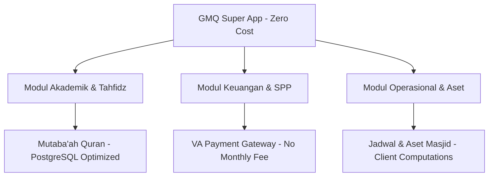

# Roadmap & Analisis Ekspansi Fitur GMQ Absensi V2 (Layanan 100% Gratis & Scalable)

Dokumen ini memuat rencana jangka pendek dan jangka panjang yang dirancang untuk **meminimalisir biaya operasional hingga Rp 0 (Zero Cost)** dengan memanfaatkan layanan gratis terukur (*scalable free tiers*) yang tidak memiliki biaya langganan bulanan.

---

## 📌 Bagian 1: Penguatan Absensi (Layanan Gratis & Scalable)

### 1. Sistem Notifikasi Orang Tua / Guru (Tanpa API WhatsApp Berbayar)
Menggunakan WhatsApp API gateway pihak ketiga membutuhkan biaya bulanan. Untuk menjaga operasional tetap gratis namun tetap *scalable*, kita dapat menggunakan alternatif berikut:

* **Opsi A: Telegram Bot API (100% Gratis & Tanpa Batas)**
  * **Deskripsi:** Membuat Telegram Bot resmi yayasan. Wali murid/guru dapat melakukan registrasi chat ID mereka.
  * **Skalabilitas:** Telegram API gratis sepenuhnya tanpa batas kuota pengiriman pesan bulanan.
  * **Integrasi:** Supabase Edge Functions memicu HTTP POST ke API Telegram saat status absensi berubah menjadi *Alpha/Izin*.
* **Opsi B: Integrasi Resend (Free Tier - 3.000 Email/Bulan)**
  * **Deskripsi:** Pengiriman notifikasi slip gaji, status kehadiran, dan laporan bulanan langsung ke email wali/guru.
  * **Skalabilitas:** Layanan email pengembang *Resend* memberikan kuota gratis hingga 3.000 email per bulan (sangat cukup untuk sekolah dengan ratusan siswa).

### 2. Portal Pengajuan Izin Mandiri (Client-Side Compression)
* **Deskripsi:** Guru/wali mengunggah foto surat izin/sakit langsung dari aplikasi.
* **Solusi Gratis & Scalable:**
  * **Supabase Storage (Free Tier - 1 GB):** Batas gratis 1 GB dapat menampung puluhan ribu surat izin jika dioptimalkan.
  * **Kompresi Gambar di Sisi Klien:** Sebelum diunggah, aplikasi Flutter akan mengompres foto surat izin menggunakan package `flutter_image_compress` hingga berukuran <100 KB per file. Ini memastikan kuota gratis 1 GB aman digunakan untuk jangka panjang (skala 10.000+ unggahan).

### 3. Otomatisasi Perhitungan Slip Gaji (Local PDF Generation)
* **Deskripsi:** Pembuatan slip gaji bulanan berdasarkan kehadiran harian dan nilai insentif.
* **Solusi Gratis & Scalable:**
  * Proses pembuatan PDF dilakukan **100% di perangkat lokal pengguna (Client-Side)** menggunakan library Dart `pdf`.
  * Server (Supabase) hanya mengirimkan data kehadiran berupa JSON ringan. Beban komputasi pembuatan layout slip gaji dialihkan ke HP/browser operator, sehingga server tetap ringan dan bebas biaya tambahan.

---

## 🗺️ Bagian 2: Roadmap Transformasi ke Multi-Fungsi (Zero-Cost Ecosystem)

### 1. Modul Akademik & Tahfidz (Mutaba'ah Quran)
* **Penyimpanan Struktur Data Efisien:**
  * Tabel `tahfidz_logs` dirancang menggunakan indeks kueri btree dan tipe data relasional yang efisien di PostgreSQL.
  * Untuk memantau hafalan, kita hanya menyimpan indeks surat (1-114) dan nomor ayat sebagai `integer` alih-alih `text`. Hal ini membuat ukuran satu baris data hanya beberapa byte, sehingga kuota database **500MB di Supabase Free Tier** bisa menampung **hingga 2 juta data entri hafalan**.

### 2. Modul Keuangan & SPP (Virtual Account Tanpa Biaya Tetap)
* **Payment Gateway Tanpa Biaya Bulanan (Pay-As-You-Go):**
  * Integrasi dengan **Midtrans** atau **Xendit** dalam mode *Production*.
  * **Biaya:** Midtrans/Xendit tidak membebankan biaya setup maupun biaya bulanan (Rp 0). Biaya hanya dikenakan per transaksi sukses (flat rate sekitar Rp 2.000 - Rp 4.000 per transaksi Virtual Account).
  * **Strategi Bebas Biaya Yayasan:** Biaya transaksi flat rate ini dapat diteruskan/dibebankan kepada wali murid saat melakukan transfer pembayaran (surcharge), sehingga yayasan tetap mendapatkan dana SPP bersih tanpa dipotong sepeser pun.

### 3. Modul Operasional & Penjadwalan Masjid
* **Optimasi Gambar Profil/Banner:**
  * Untuk mencegah konsumsi penyimpanan Supabase Storage, kita dapat menggunakan URL eksternal gratis untuk file media besar (seperti brosur kegiatan masjid) menggunakan integrasi Cloudinary (Free Tier - 25 GB storage) atau Google Drive API.

---

## 🔒 Bagian 3: Ringkasan Kuota Layanan Gratis yang Digunakan

| Nama Layanan | Kuota Gratis (Free Tier) | Manfaat untuk Aplikasi GMQ | Skalabilitas Maksimum |
| :--- | :--- | :--- | :--- |
| **Supabase Database** | 500 MB PostgreSQL | Data Master, Absensi, Tahfidz, Keuangan | ~2-3 Juta Baris Data |
| **Supabase Auth** | 50.000 Active Users / bln | Autentikasi Pengguna & Wali Murid | 50.000 Akun Aktif |
| **Supabase Storage** | 1 GB Storage | Unggahan Foto Izin / Slip | ~10.000 Foto Terkompresi |
| **Telegram Bot API** | 100% Gratis Tanpa Batas | Notifikasi Absensi Instan | Tidak Terbatas |
| **Resend (Email)** | 3.000 Email / bulan | Slip Gaji & Verifikasi Sistem | 100 Email per hari |
| **Firebase Hosting** | 10 GB Storage & 360 MB/hari | Hosting Aplikasi Flutter Web | ~10.000 Kunjungan Web/hari |
| **Midtrans / Xendit** | Rp 0 Setup, Rp 0 Bulanan | Pembayaran SPP & Donasi Otomatis | Pembayaran VA & E-wallet tak terbatas |
