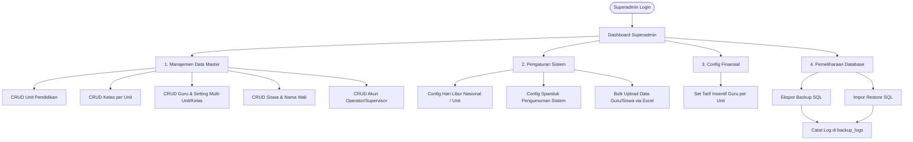
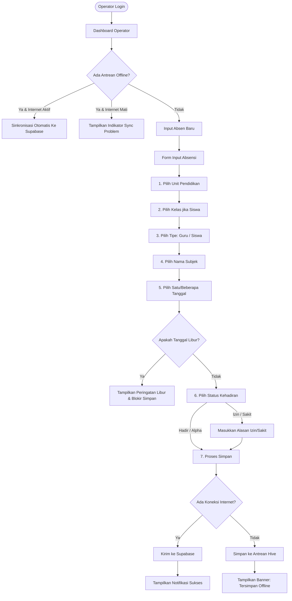
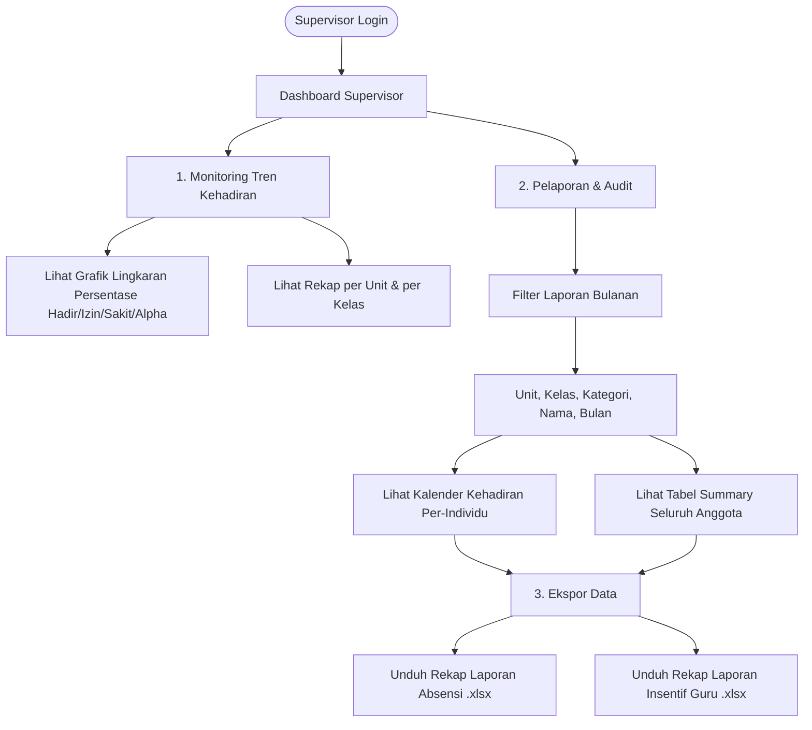

# Alur Bisnis Berdasarkan Peran (Role Workflow) - GMQ Absensi V2

Dokumen ini menjelaskan alur bisnis langkah demi langkah yang dialami dan dilakukan oleh masing-masing peran pengguna (*role*) di dalam aplikasi **GMQ Absensi V2** (GMQ Super App).

---

## 1. Alur Kerja Peran: Superadmin

Superadmin bertanggung jawab atas pengelolaan seluruh data master, konfigurasi keuangan (insentif), kalender libur, serta pemeliharaan sistem (backup/restore).

### Langkah Operasional Superadmin:
1.  **Pengelolaan Data Master (CRUD)**:
    *   Mendaftarkan unit pendidikan baru (misalnya SD, SMP, SMA, Pondok).
    *   Membuat kelas di masing-masing unit.
    *   Memasukkan profil guru. Jika guru mengajar di lebih dari satu unit atau kelas, admin memilih unit/kelas terkait yang akan disimpan sebagai array ID (`unit_ids` dan `kelas_ids`).
    *   Memasukkan profil siswa beserta nama orang tua/wali untuk koordinasi.
    *   Membuat akun pengguna (`users`) untuk operator unit atau supervisor yayasan.
2.  **Konfigurasi Tarif Insentif**:
    *   Memilih guru $\rightarrow$ Memilih Unit Pendidikan $\rightarrow$ Menginputkan nominal insentif harian (misal: Rp50.000). Data ini disimpan ke tabel `insentif_guru`.
3.  **Pengelolaan Kalender Libur**:
    *   Menambahkan hari libur (misalnya libur nasional atau libur khusus unit pondok). Absensi akan terkunci secara otomatis pada tanggal-tanggal tersebut.
4.  **Operasional Pemeliharaan**:
    *   Melakukan backup database secara berkala atau mengunggah data guru/siswa secara massal (*bulk upload*) menggunakan template Excel untuk menghemat waktu input.

---

## 2. Alur Kerja Peran: Operator

Operator bertugas melakukan pencatatan absensi harian secara langsung di sekolah/unit masing-masing, baik dalam kondisi online maupun offline.

### Langkah Operasional Operator:
1.  **Pemeriksaan Koneksi & Antrean**:
    *   Buka dasbor. Jika terdapat ikon `sync_problem` berwarna oranye dengan angka, itu menunjukkan adanya data absensi yang belum terkirim ke server karena sebelumnya offline.
    *   Jika internet sudah stabil, tekan tombol **Sync** (ikon putar) untuk mengirimkan data ke database cloud.
2.  **Melakukan Pencatatan Absensi (Harian / Rapel)**:
    *   Masuk ke menu **Input Absen**.
    *   Pilih unit pendidikan yang sedang dioperasikan.
    *   Tentukan subjek absensi (Guru atau Siswa). Jika Siswa, pilih kelasnya terlebih dahulu.
    *   Pilih nama guru atau siswa yang bersangkutan.
    *   Pilih tanggal absensi. Operator dapat memilih lebih dari satu tanggal sekaligus jika ingin merapel absensi yang terlewat.
    *   Tentukan status:
        *   **Hadir**: Langsung disimpan.
        *   **Izin / Sakit**: Masukkan detail alasan (misal: "Sakit Demam" atau "Acara Keluarga").
        *   **Alpha**: Ketidakhadiran tanpa keterangan.
3.  **Melihat Laporan Harian/Bulanan**:
    *   Mengecek statistik kehadiran hari ini pada grafik lingkaran dasbor.
    *   Masuk ke menu **Laporan Absensi** atau **Laporan Insentif Guru** untuk memantau data yang sudah diinput atau mengekspornya ke Excel.

---

## 3. Alur Kerja Peran: Supervisor

Supervisor (biasanya jajaran pengurus yayasan/kepala sekolah) memiliki peran pengawasan. Mereka memantau tren kehadiran dan mengunduh rekapitulasi data keuangan insentif guru untuk pencairan dana.

### Langkah Operasional Supervisor:
1.  **Pemantauan Real-time (Monitoring)**:
    *   Membuka dasbor untuk melihat persentase kehadiran hari ini guna memantau kedisiplinan guru dan santri di seluruh unit pendidikan di bawah yayasan YGMQ.
2.  **Analisis Laporan Bulanan**:
    *   Masuk ke menu **Laporan Absensi**.
    *   Melakukan filter berdasarkan bulan dan unit pendidikan tertentu.
    *   Melihat ringkasan (*Summary*) kehadiran semua anggota (Hadir sekian kali, Izin sekian kali, Sakit sekian kali, Alpha sekian kali, Libur sekian kali).
    *   Atau melakukan inspeksi mendalam terhadap satu orang (*Per User*) dengan melihat tampilan kalender bulanan yang berwarna-warni sesuai status kehadiran (Hijau = Hadir, Oranye = Izin, Biru = Sakit, Merah = Alpha).
3.  **Pencairan Insentif Guru (Export Keuangan)**:
    *   Masuk ke menu **Laporan Insentif Guru**.
    *   Memilih bulan berjalan.
    *   Sistem menyajikan daftar guru beserta total kehadiran hadir mereka dan nominal insentif yang harus dibayarkan.
    *   Supervisor menekan tombol **Export** untuk mendapatkan berkas Excel laporan tersebut sebagai dasar pembayaran payroll bulanan oleh bendahara yayasan.
